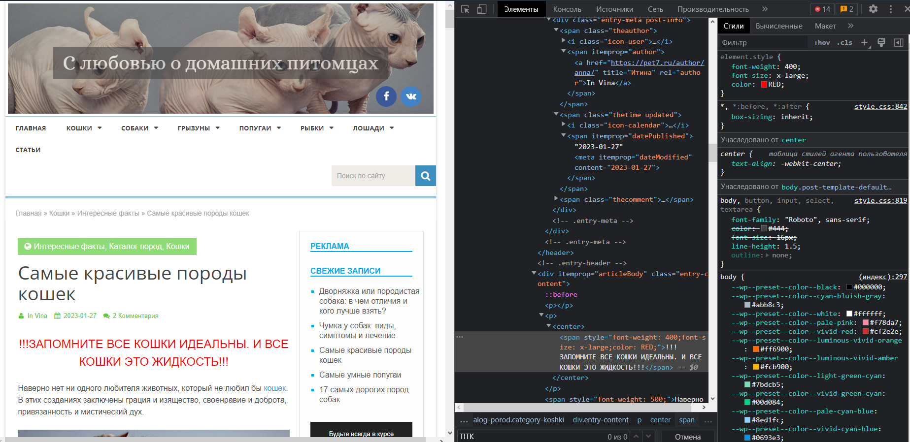

#Задача#

На основе сайта https://pet7.ru/koshki/interesnye-fakty-koshki/samye-krasivye-porody-koshek/

Определите, на каком протоколе работает сайт.
Проанализируйте структуру страницы сайта.
Внесите не менее 3 изменения на страницу с помощью инструмента разработчика и представьте скриншоты было/стало.
Создайте прототип низкой детализации (дополнительное задание, если на семинаре дошли до задания №8).

#Решение#

## 1. Протокол сайта - HTTPS ##

## 2. Структура ##

В общем сайт состоит из *Заголовка* \<head>...\</head> и *Тела* \<body>...\</body>. 

В заголовке находяться общие данные о сайте (\<meta>), некоторые стили (\<style>) и скрипты (\<script>).

В теле сайта дополнительно находиться все, что отображается на странице.

## 3. Изменения ##

1. Внесем изменения в заголовке сайта. Изменим текст, появляющийся при наведении мыши на вкладку.

2. Внесем изменение в текст тела, изменив Автора статьи, дату статьи и добавив надпись в начале.

 
3. Заменим картинку и расширим для неё участок. Удалим лишний поиск. Сделаем фоновый цвет градиентом.

## 4. Прототип низкой детализации ##

